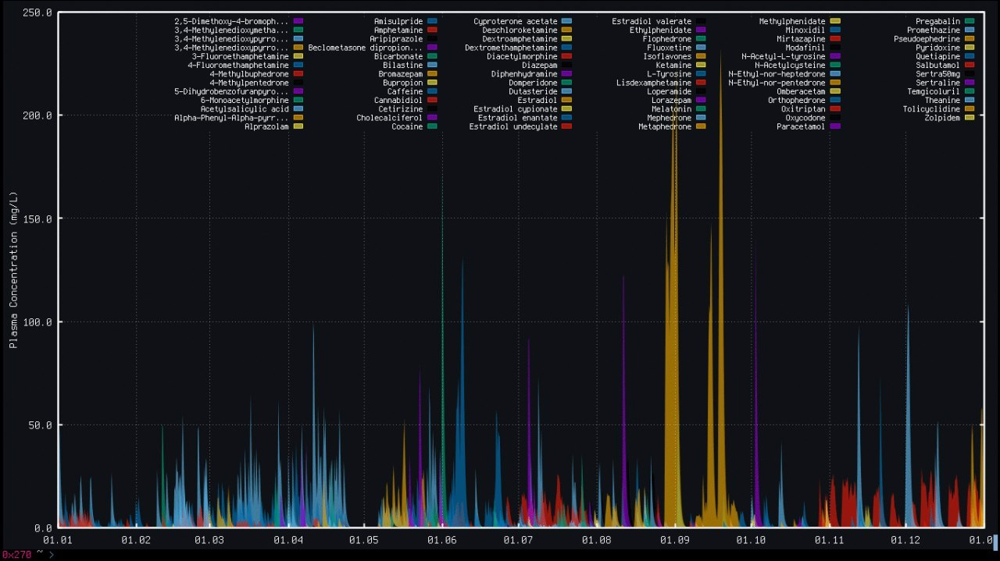

# Dkinplot



### Dependencies
- ruby
- ruby-gnuplot
- (optional) libsixel

### Usage

#### CSV Log format
```csv
timestamp,user,med,amount,ROA,comment
2025-12-03T08:00:31.987Z,User,Metaphedrone,50mg,Intravenous,left-median-cubital hydrochloride-salt
```

```shell
ruby dkinplot.rb --csv example.csv -o plot.png -s "2024-01-01T00:00" -t "2024-06-01T00:00"
```

#### Journal exported logs
```shell
ruby dkinplot.rb --journal example_journal.json -o plot.png -s "2024-01-01T00:00" -t "2024-06-01T00:00"
```
